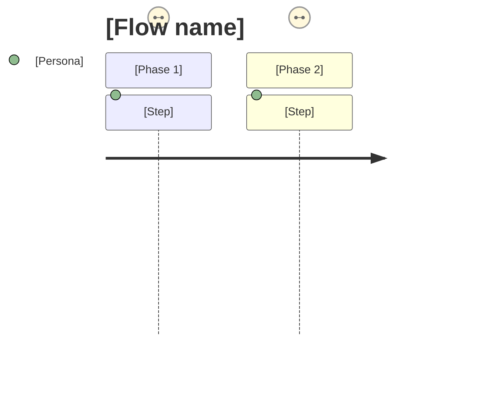

# SDD Core Template — 8 Sections

This is the canonical structure for a JINC Apps SDD. Each section has guidance on what to include, what signals good quality, and what to skip based on context.

---

## Section 1 — 🌟 North Star (Vision & JTBD)

**Purpose:** Define the WHY before the WHAT. This anchors every future decision.

**Required fields:**

```markdown
## 1. North Star

### Vision

[One sentence: What does the world look like when this succeeds? Focus on user outcome, not feature list.]

> Example: "Journalists with any disability level can independently publish, edit, and manage editorial content without needing technical assistance."

### Problem Statement

[2-3 sentences: What is broken today? Who suffers? What is the cost of inaction?]

### Jobs to be Done (JTBD)

- **When** [context/trigger], **I want to** [motivation], **so I can** [outcome]
- [Repeat for 3-5 primary jobs]

### Success Metrics (OKR-ready)

| Metric                       | Baseline  | Target | Timeline  |
| ---------------------------- | --------- | ------ | --------- |
| [e.g., Task completion rate] | [current] | [goal] | [quarter] |

### Non-Goals (Explicit Exclusions)

- [What this system deliberately does NOT do — prevents scope creep]
```

**Quality signal:** A good North Star lets any team member make a decision WITHOUT asking the product owner. If it's vague enough to justify contradictory decisions, rewrite it.

---

## Section 2 — 🗺️ Functional Scope (User Stories & Journeys)

**Purpose:** Define WHAT the system does from the user's perspective.

**Required fields:**

````markdown
## 2. Functional Scope

### User Personas

| Persona | Context          | Primary Goal | Tech Literacy  |
| ------- | ---------------- | ------------ | -------------- |
| [Name]  | [Role/situation] | [Core need]  | [Low/Med/High] |

### User Stories (Gherkin format)

**Epic: [Epic Name]**

**Story US-001:** [Short title]

- **As a** [persona]
- **I want to** [action]
- **So that** [outcome]
- **Acceptance Criteria:**
  - [ ] Given [context], When [action], Then [result]
  - [ ] Given [edge case], When [action], Then [graceful result]

### User Journeys (Critical Flows)


````

### Feature Map

| Feature        | Priority | Complexity  | Phase        |
| -------------- | -------- | ----------- | ------------ |
| [Feature name] | P0/P1/P2 | XS/S/M/L/XL | MVP/V1/Scale |

````

**Quality signal:** Every story should be independently testable. If you can't write a "Given/When/Then" for it, it's not a story — it's a goal. Break it down.

---

## Section 3 — 🏗️ Architecture C4

**Purpose:** Show HOW the system is structured at increasing levels of detail.

**Always generate Context + Container. Add Component only if complexity > medium.**

```markdown
## 3. Architecture C4

### Context Diagram (Level 1) — Who uses what?
```mermaid
C4Context
  title System Context — [System Name]
  Person(user, "[Primary User]", "[Their goal]")
  Person(adminUser, "[Admin]", "[Admin role]")
  System(system, "[This System]", "[Core function]")
  System_Ext(extSystem, "[External System]", "[Purpose]")

  Rel(user, system, "Uses", "HTTPS")
  Rel(system, extSystem, "Calls", "REST/webhook")
````

### Container Diagram (Level 2) — What runs?

```mermaid
C4Container
  title Container Diagram — [System Name]
  Person(user, "[User]")

  Container(webapp, "[Web App]", "[Next.js / React]", "[Serves UI]")
  Container(api, "[API]", "[Node.js / FastAPI]", "[Business logic]")
  ContainerDb(db, "[Database]", "[Postgres / Supabase]", "[Persistent data]")
  Container(cache, "[Cache]", "[Redis / Upstash]", "[Session + query cache]")

  Rel(user, webapp, "Uses", "HTTPS")
  Rel(webapp, api, "API calls", "REST/GraphQL")
  Rel(api, db, "Reads/writes", "SQL")
  Rel(api, cache, "Reads/writes", "Redis protocol")
```

### Component Diagram (Level 3) — [Only if complexity > medium]

[Show internals of the most complex container]

### Architecture Decision Records (ADRs)

| #       | Decision                              | Rationale                                          | Consequences              | Status      |
| ------- | ------------------------------------- | -------------------------------------------------- | ------------------------- | ----------- |
| ADR-001 | [e.g., Use Supabase over custom Auth] | [e.g., Built-in RLS, PKCE flows, team familiarity] | [e.g., Vendor dependency] | 🟢 Accepted |
| ADR-002 | [Decision]                            | [Why]                                              | [Trade-offs]              | 🟡 Proposed |

````

**Quality signal:** Anyone joining the team cold should understand the system topology in 5 minutes from these diagrams alone.

---

## Section 4 — 📡 Data Contract (APIs & Event Schemas)

**Purpose:** Define the contract between consumers and producers of data.

**Use OpenAPI for REST/HTTP. Use AsyncAPI for event-driven / message queue systems.**

```markdown
## 4. Data Contract

### REST Endpoints Summary (if applicable)
| Method | Endpoint | Auth | Description | Status Codes |
|--------|----------|------|-------------|-------------|
| GET | `/api/v1/articles` | Bearer | List published articles | 200, 401, 403 |
| POST | `/api/v1/articles` | Bearer | Create draft article | 201, 400, 409 |

*Full OpenAPI spec: `docs/contracts/api-v1.yaml`*

### Event Schema Summary (if event-driven)
| Event | Producer | Consumer | Payload | Channel |
|-------|----------|----------|---------|---------|
| `article.published` | CMS | Notification Service | `{id, slug, author_id, timestamp}` | `jinc.editorial` |

*Full AsyncAPI spec: `docs/contracts/events-v1.yaml`*

### Data Models (Core entities)
```typescript
// Example — adapt to your actual stack
interface Article {
  id: string;              // UUID v4
  slug: string;            // URL-safe, unique
  title: string;           // Max 255 chars
  status: 'draft' | 'review' | 'published' | 'archived';
  author_id: string;       // References User.id
  alt_text: string | null; // Accessibility — required on publish
  created_at: Date;
  updated_at: Date;
}
````

### Authentication & Authorization

| Scope         | Method           | Token Lifetime          | Notes                           |
| ------------- | ---------------- | ----------------------- | ------------------------------- |
| Public read   | None             | —                       | Rate-limited: 100 req/min       |
| Authenticated | JWT (PKCE)       | 1h access / 30d refresh | Supabase Auth                   |
| Admin         | JWT + role claim | 1h                      | RLS policy enforced at DB level |

````

---

## Section 5 — ⚙️ Tech Stack & Constraints

**Purpose:** Document WHAT technology is chosen and WHY — these become the ADRs' technical appendix.

```markdown
## 5. Tech Stack & Constraints

### Chosen Stack — [Option Name, e.g., "Balanced"]

| Layer | Technology | Version | Rationale |
|-------|-----------|---------|-----------|
| Frontend | Next.js | 15.x App Router | SSR, accessibility, JINC standard |
| Backend/API | Next.js API Routes + Prisma | — | Collocated, type-safe |
| Database | Supabase (Postgres 16) | — | RLS, realtime, JINC infra standard |
| Auth | Supabase Auth (PKCE) | — | WCAG-compliant flows |
| Cache | Upstash Redis | — | Edge-compatible, serverless |
| Deployment | Vercel | — | Preview deployments, ISR |
| Monitoring | Sentry + Vercel Analytics | — | Error tracking + Core Web Vitals |
| CI/CD | GitHub Actions | — | JINC DevOps standard |

### Hard Constraints
- WCAG 2.2 AAA compliance required on all user-facing interfaces
- No purple/violet in UI (JINC design system rule)
- All secrets via environment variables — never hardcoded
- Maximum response time: 200ms p95 for API endpoints (document exceptions)
- Branch strategy: `main` → `feat/*` → PR → merge (no direct pushes to main)

### Known Limitations (document explicitly)
| Limitation | Impact | Mitigation | Revisit At |
|-----------|--------|------------|------------|
| [e.g., Supabase connection pooling limit: 200] | [Bottleneck at ~5k concurrent users] | [PgBouncer via Supabase Pro] | [V1 milestone] |
````

---

## Section 6 — 📋 Business Rules Engine

**Purpose:** Formalize business logic as explicit, testable rules — not buried in code comments.

````markdown
## 6. Business Rules Engine

### Rule Table Format

Use decision tables for conditional logic. Use pseudo-code for sequential rules.

**Rule BR-001: Article Publication Eligibility**
| Condition | Value | Action |
|-----------|-------|--------|
| Article status | `draft` + `review` only | Allow publish action |
| Alt text | Missing on any image | 🔴 BLOCK — return error `ACCESSIBILITY_REQUIRED` |
| Author role | `editor` or `admin` | Allow |
| Author role | `contributor` | 🔴 BLOCK — requires review approval |
| Word count | < 100 words | ⚠️ WARN — confirm intent |

**Rule BR-002: [Rule Name]**

```pseudo
IF user.role == "contributor"
  AND article.status == "review"
  AND article.reviewer_id IS NOT NULL
THEN allow article.publish()
ELSE raise PermissionError("CONTRIBUTOR_NEEDS_REVIEW")
```
````

### Edge Cases & Error Scenarios

| Scenario                         | Expected Behavior                         | Error Code                 |
| -------------------------------- | ----------------------------------------- | -------------------------- |
| User publishes without alt text  | Block with clear accessibility error      | `E_ACCESSIBILITY_REQUIRED` |
| Concurrent edits to same article | Last-write-wins + conflict notification   | `E_CONFLICT_DETECTED`      |
| Session expires mid-draft        | Auto-save to localStorage, prompt re-auth | —                          |

````

---

## Section 7 — ✅ Definition of Done

**Purpose:** Define what "done" means — technically and from a business perspective.

```markdown
## 7. Definition of Done

### Technical DoD (Must pass before merging)
- [ ] Unit tests cover all business rules (≥ 80% coverage)
- [ ] Integration tests cover all critical user flows
- [ ] No TypeScript `any` types without explicit justification
- [ ] All API endpoints have OpenAPI documentation
- [ ] WCAG 2.2 AA minimum (AAA target) validated with axe-core
- [ ] Lighthouse score ≥ 90 on all Core Web Vitals
- [ ] No secrets committed (gitleaks scan passes)
- [ ] `checklist.py` passes without critical blockers
- [ ] PR reviewed by at least 1 team member

### Business DoD (Must be validated before release)
- [ ] All user stories in scope pass acceptance criteria
- [ ] Product owner sign-off on flows
- [ ] Error messages are human-readable and actionable
- [ ] Feature works on: Chrome, Firefox, Safari (latest 2 versions)
- [ ] Feature works on: Mobile (iOS Safari, Android Chrome)
- [ ] Rollback procedure documented and tested

### Observability DoD
- [ ] Key events are logged (article.published, user.auth, error.*)
- [ ] Alerts configured for p95 latency > 500ms
- [ ] Error rate alert configured (> 1% errors triggers page)
````

---

## Section 8 — 🚀 Delivery Phases

**Purpose:** Sequence delivery to maximize learning and minimize risk.

```markdown
## 8. Delivery Phases

### Phase 0 — Foundation (Week 1-2)

**Goal:** Infrastructure ready, team unblocked

- [ ] Repository setup with JINC DevOps conventions
- [ ] CI/CD pipeline (GitHub Actions)
- [ ] Environment configuration (dev/staging/prod)
- [ ] Database schema migrations baseline
- [ ] Authentication flows working end-to-end

### Phase 1 — MVP (Week 3-6)

**Goal:** Core value delivered to first users
**Scope:**

- [User Story US-001]: [Feature]
- [User Story US-002]: [Feature]
- [User Story US-003]: [Feature]

**NOT in MVP (explicitly excluded):**

- [Feature]: Deferred to V1 because [reason]

**MVP Exit Criteria:**

- [ ] [N] real users can complete [core flow] successfully
- [ ] Error rate < 1% in production
- [ ] All P0 stories pass acceptance tests

### Phase 2 — V1 (Week 7-12)

**Goal:** Feature complete for general release
**Scope:**

- [Remaining P1 stories]
- Performance optimization
- Analytics integration
- [Platform expansion if applicable]

### Phase 3 — Scale

**Goal:** System handles 10x current load without re-architecture

- Caching strategy review
- Database indexing audit
- CDN and edge optimization
- Load testing with [target: X req/s]

### Risk Register

| Risk                                | Probability | Impact | Mitigation                      |
| ----------------------------------- | ----------- | ------ | ------------------------------- |
| [e.g., Supabase rate limits in MVP] | Medium      | High   | Implement request queuing early |
| [External API instability]          | Low         | Medium | Circuit breaker pattern         |
```
